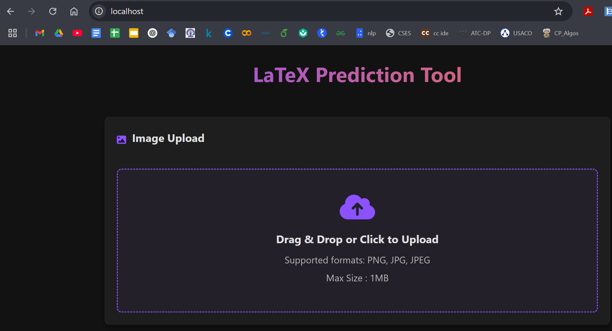
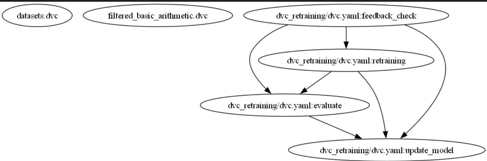
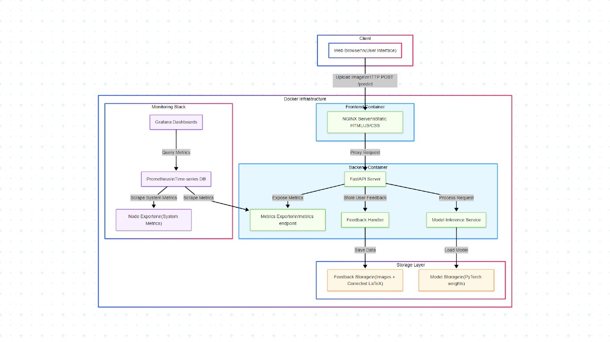
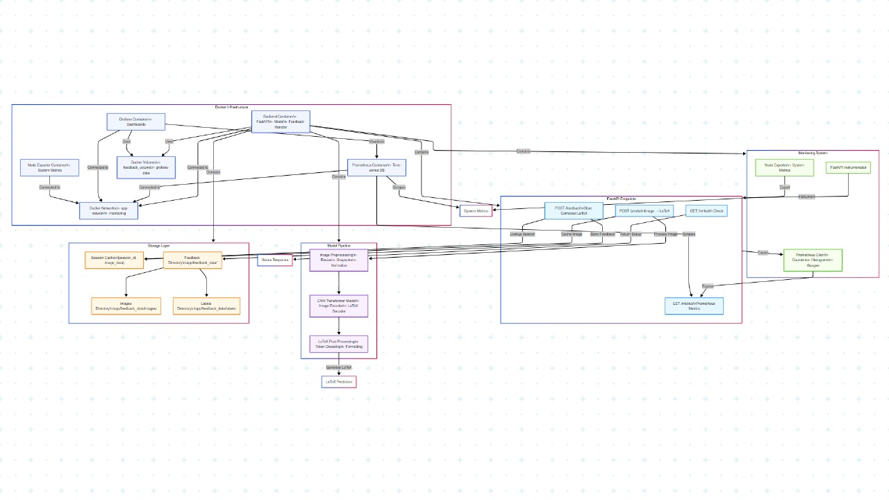

# AI_Dev_Project
## DA5402 final project
### DA24M009
### DA24M026

This repository contains a comprehensive MLOps pipeline for an AI development project, implementing best practices for continuous integration, deployment, monitoring, and model retraining.

## Project Pipeline

The MLOps pipeline implements the following workflow:

1. **Data Version Control**: Dataset management and versioning using DVC
2. **Model Training**: ML model training with reproducible results
3. **Model Serving**: Containerized backend API for inference
4. **User Interface**: React-based frontend for user interaction
5. **Monitoring**: Prometheus for system and model performance monitoring
6. **Feedback Loop**: Automated feedback collection for model retraining
7. **Continuous Integration/Deployment**: Automated testing and deployment

## Docker Compose Infrastructure

The project uses Docker Compose to orchestrate multiple services:

### Frontend Container

The frontend is built using React.js, providing an intuitive user interface for interacting with the AI model. The UI allows users to:

- Submit data for predictions
- View prediction results
- Provide feedback on model performance
- Access historical predictions

*[]*

### Backend Container

The backend service provides:

- RESTful API for model inference
- Authentication and authorization
- Request logging and validation
- Integration with the ML model
- Feedback collection endpoints

### Prometheus Container

Prometheus is used for monitoring and alerting:

- System metrics (CPU, memory, disk usage)
- Application metrics (request rates, latencies)
- Model performance metrics (accuracy, prediction distribution)
- Custom dashboards for visualization

## Feedback Mount System

The feedback mount system implements a closed-loop ML architecture:

1. **Feedback Collection**: User feedback is collected through the UI and stored
2. **Data Aggregation**: Feedback is combined with original predictions
3. **Quality Assessment**: Feedback data is validated and preprocessed
4. **Model Retraining Trigger**: When sufficient feedback is collected, retraining is automatically triggered
5. **Performance Evaluation**: New model is evaluated against previous versions
6. **Model Promotion**: If the new model outperforms the current one, it's promoted to production

This system ensures the model continually improves based on real-world usage patterns.

## DVC DAG Retraining

The project uses DVC (Data Version Control) to manage the model retraining pipeline:

*[]*

This Directed Acyclic Graph (DAG) ensures:
- Reproducible model retraining
- Data and model versioning
- Automated pipeline execution
- Experiment tracking

## Kaggle Dataset and Training

The model is trained on [Dataset Name] from Kaggle, which contains [brief description of the dataset].

The training process includes:
- Exploratory data analysis
- Data preprocessing and feature engineering
- Model selection and hyperparameter tuning
- Cross-validation
- Performance evaluation

The Kaggle notebook demonstrates the end-to-end training process and can be used as a reference for understanding the model architecture and training methodology.

## Architecture Diagrams

### High-Level Design (HLD)

*[]*

The HLD illustrates the overall system architecture, showing the interaction between different components and the data flow through the system.

### Low-Level Design (LLD)

*[]*

The LLD provides detailed information about each component, including:
- Internal structures
- Data models
- APIs and interfaces
- Component dependencies

## Module Explanations

### Data Management Module

This module handles all aspects of data in the system:
- Data ingestion from various sources
- Data preprocessing and transformation
- Data validation and quality checks
- Data versioning using DVC

### Model Training Module

Responsible for developing and updating the ML models:
- Feature engineering
- Model training with hyperparameter optimization
- Model evaluation and validation
- Model serialization and versioning

### API Service Module

Exposes the model capabilities via REST API:
- Request handling and validation
- Model inference
- Response formatting
- Authentication and rate limiting

### Monitoring Module

Tracks system health and model performance:
- Custom metrics collection
- Alerting on predefined thresholds
- Performance dashboards
- Automated reporting

### Feedback Module

Manages the feedback collection and processing:
- User feedback storage
- Feedback validation and preprocessing
- Integration with retraining pipeline
- Feedback analytics

## Running the Project

### Prerequisites

- Docker and Docker Compose
- Git
- DVC
- Python 3.8+

### Setup and Installation

1. Clone the repository:
```bash
git clone https://github.com/yeshu183/AI_Dev_Project.git
cd AI_Dev_Project
```

2. Initialize DVC:
```bash
dvc init
dvc pull
```

3. Start the containers:
```bash
docker-compose up -d
```

### Running the Frontend

```bash
cd frontend
npm install
npm start
```

### Running the Backend

```bash
cd backend
python -m venv venv
source venv/bin/activate  # On Windows: venv\Scripts\activate
pip install -r requirements.txt
python app.py
```

### Accessing Prometheus Dashboard

Navigate to `http://localhost:9090` in your browser to access the Prometheus dashboard.

### Model Retraining

To trigger model retraining:

```bash
dvc repro train.dvc
```
